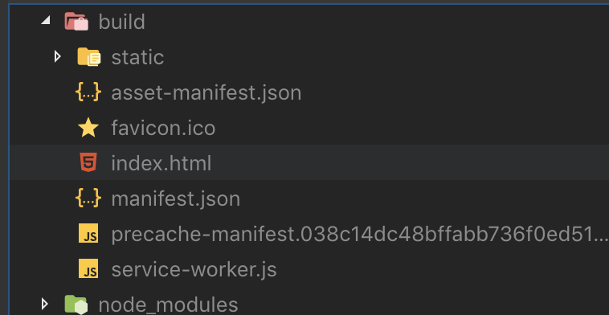

#Petapp

## Pasos previos
Para poder deployar esta super aplicación lo que tenés que hacer previamente es:

- Tener bajado [node y npm](https://nodejs.org/en/download/).
- Tener git instalado.
- Tener este repositorio clonado.
- correr el comando `npm install` o `npm i` para instalar las dependencias del proyecto.
- Si vas a usar el cli de aws necesitás tenerlo bajado e instalado con el access key y el secret access key instalado.

## Generar un build
Para poder obtener la verión final de tu web lo que tenes que hacer es correr el comando `npm run build`.

Esto te va a generar una carpeta build como esta:


## Subir el build
Lo que tenes que subir ahora es todo el contenido de la carpeta build a un bucket de S3.
Si usas el cli de aws el comando para subirlo es:
`aws s3 sync build <NOMBRE DEL BUCKET>`

## Generar la invalidation (opcional)
Si estas usando el servicio de cloudfront como cdn vas a tener que correr una invalidation, esto lo que hace es enviar la señal a los distintos servidores de que el contenido está desactualizado y debe buscarse devuelta del bucket.

## Modo fácil:
Si no tenés acceso a la consola de aws pero tenés credenciales, nombre del bucket y el id de la distribución podes hacer lo siguiente:
1. Instalate globalmente el [siguiente package](https://www.npmjs.com/package/aws-deploy-script-fe) usando el comando `npm i -g aws-deploy-script-fe`
2. Luego en el root del proyecto create el siguiente archivo con el nombre `aws.js` y el siguiente contenido

```js
module.exports = {
  development: {
    accessKeyId: "XXXXXXXXXXXXXXXXXXXX",
    secretAccessKey: "XXXXXXXXXXXXXXXXXXXXXXXXXXXXXXXXXXX",
    region: "us-east-1",
    bucket: "<Name of the bucket>",
    distributionId: "XXXXXXXXXXXXXX"
  }
};
```
3. Luego correr en la consola `aws-deploy` y listo, este script te sube al bucket y te crea la invalidation de forma fácil y rápida.